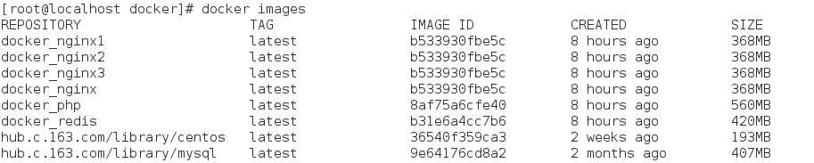
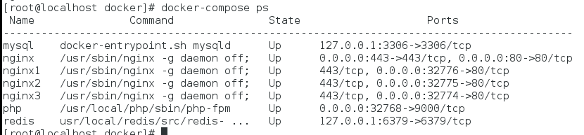
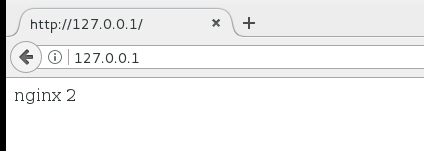

## Docker和nginx实现简单的服务器负载均衡
>1. 当请求负载在单节点处理能力之下时，没有必要设置负载均衡器，所有的请求都由一台服务器搞定；
>2. 当请求达到一定数量，超过了单台服务器处理能力，那么现在就需要添加多台服务器，并且使用负载均衡器（Load Balancer）进行流量分发，保证业务请求平均地分散到各 web 服务器；
>3. 业务的流量特点很多变，流量高峰何时到来谁也不知道，如果使用多台 web 服务器在后台值班，这样难免会造成资源的浪费，并且这样也有可能无法应对流量峰值，因此需要一个自动的负载均衡器，它能够实时检测当前到来的业务流量，并且能够控制后端资源池快速完成资源的申请、释放以及路由切换，这样就可以通过实时的流量检测数据完成 web 服务器的动态配置，在后端资源池能力足够的情况下，轻松应对多变的请求量。

现在我们使用docker-compose容器编排来构建简单的负载均衡

上篇文章已经介绍了使用docker-compose搭建lnmp容器了，[点击查看](https://www.voocel.com/dockerlnmp)可以直接将文件全部拷贝过来

#### 修改docker-compose.yml文件
```
version: '2'
services:
  nginx:
    depends_on:
      - php
    build: ./nginx
    volumes:
      - ./nginx/www:/usr/share/nginx/html
      - ./nginx/nginx.conf:/etc/nginx/nginx.conf
      - ./nginx/log/error.log:/var/log/nginx/error.log
    restart: always

    ports:
      - "80:80"
      - "443:443"
    links:
      - nginx1
      - nginx2
      - nginx3
    container_name: nginx
  
  nginx1:
    depends_on:
      - php
    build: ./nginx
    volumes:
      - ./nginx1/www:/usr/share/nginx/html
      - ./nginx1/nginx.conf:/etc/nginx/nginx.conf
      - ./nginx1/log/error.log:/var/log/nginx/error.log
    restart: always

    ports:
      - "80"
    container_name: nginx1

  nginx2:
    depends_on:
      - php
    build: ./nginx
    volumes:
      - ./nginx2/www:/usr/share/nginx/html
      - ./nginx2/nginx.conf:/etc/nginx/nginx.conf
      - ./nginx2/log/error.log:/var/log/nginx/error.log
    restart: always

    ports:
      - "80"
    container_name: nginx2

  nginx3:
    depends_on:
      - php
    build: ./nginx
    volumes:
      - ./nginx3/www:/usr/share/nginx/html
      - ./nginx3/nginx.conf:/etc/nginx/nginx.conf
      - ./nginx3/log/error.log:/var/log/nginx/error.log
    restart: always

    ports:
      - "80"
    container_name: nginx3
```

其实就是再创建三个nginx服务器，由nginx作为作为负载均衡器把请求转发到三个web服务器上，我们用links来连接三个web服务器。nginx1、nginx2、nginx3作为web服务器(volumes根据自己的情况配置)
#### 启动docker-compose 构建镜像
```
docker-compose up -d
```
#### 查看镜像


#### 查看状态
 

这样说明nginx负载均衡器和三个web服务器都启动成功了

#### 修改nginx配置文件（注意不是nginx1、nginx2、nginx3的）
```
upstream myweb{
        server nginx1  max_fails=3 fail_timeout=20s weight=2;
        server nginx2  max_fails=3 fail_timeout=20s weight=10;
        server nginx3  max_fails=3 fail_timeout=20s weight=2;
    }

    server {
        listen       80;
        server_name  localhost;

        #access_log  logs/host.access.log  main;
        root       /usr/share/nginx/html;
        location / {
            index inde.php index.html index.htm;

            #如果服务器要获取客户端真实IP，可以用下三句设置主机头和客户端真实地址
            #proxy_set_header Host $host;
            #proxy_set_header X-Real-IP $remote_addr;
            #proxy_set_header X-Forwarded-For $proxy_add_x_forwarded_for;

            proxy_pass http://myweb; #反向代理地址，表示将所有请求转发到phpServers服务器组中配置的某一台服务器上。为upstream后定义的名字
            
        }
```
#### 为三个web服务器的根目录各自添加index.html,为下面的测试用


#### 在浏览器中访问测试效果


每次刷新内容都不同说明成功。


## nginx负载均衡的四种配置方案
>Nginx负载均衡是通过upstream模块来实现的，负载均衡有4种方案配置
1. 轮询

    轮询即Round Robin，根据Nginx配置文件中的顺序，依次把客户端的Web请求分发到不同的后端服务器上
2. 最少连接 least_conn;

    Web请求会被转发到连接数最少的服务器上。
3. IP地址哈希 ip_hash;

    前述的两种负载均衡方案中，同一客户端连续的Web请求可能会被分发到不同的后端服务器进行处理，因此如果涉及到会话Session，那么会话会比较复杂。常见的是基于数据库的会话持久化。要克服上面的难题，可以使用基于IP地址哈希的负载均衡方案。这样的话，同一客户端连续的Web请求都会被分发到同一服务器进行处理。
4. 基于权重 weight

    基于权重的负载均衡即Weighted Load Balancing，这种方式下，我们可以配置Nginx把请求更多地分发到高配置的后端服务器上，把相对较少的请求分发到低配服务器。


#### 1.轮询
```
upstream phpServers {  #phpServers可自定义
    server 172.17.0.2;
    server 172.17.0.3;
}

server {  
    listen 80 default_server;
    listen [::]:80 default_server ipv6only=on;

    root /docker-ubuntu/www;
    index  index.php index.html index.htm;

    # Make site accessible from http://localhost/
    server_name localhost;

    location / {        
        index inde.php index.html index.htm;

        #如果服务器要获取客户端真实IP，可以用下三句设置主机头和客户端真实地址
        #proxy_set_header Host $host;
        #proxy_set_header X-Real-IP $remote_addr;
        #proxy_set_header X-Forwarded-For $proxy_add_x_forwarded_for;

        proxy_pass http://phpServers; #表示将所有请求转发到phpServers服务器组中配置的某一台服务器上。为upstream后定义的名字
    }

}
```
upstream模块：配置反向代理服务器组，Nginx会根据配置，将请求分发给组里的某一台服务器。tomcats是服务器组的名称。

upstream模块下的server指令：配置处理请求的服务器IP或域名，端口可选，不配置默认使用80端口。通过上面的配置，Nginx默认将请求依次分配给172.17.0.2，172.17.0.3来处理

#### 2.基于权重 weight
```
upstream phpServers {  
    # weight表示权重，数值越大，表示被分配到这个server的几率越大,比如以下配置，每请求 三次，就有两次分配到了 172.17.0.2
    server 172.17.0.2 weight=2;
    server 172.17.0.3 weight=1;
}

server {  
    listen 80 default_server;
    listen [::]:80 default_server ipv6only=on;

    root /docker-ubuntu/www;
    index  index.php index.html index.htm;

    # Make site accessible from http://localhost/
    server_name localhost;

    location / {
        proxy_pass http://phpServers; #表示将所有请求转发到phpServers服务器组中配置的某一台服务器上。
    }

}
```
除了 weight 之外，还有别的配置项
```
upstream phpServers {  
    server 172.17.0.2 weight=2 max_fails=1 fail_timeout=20 max_conns=100;
    server 172.17.0.3 weight=1 backup down
}
```
*max_fails

默认为1。某台Server允许请求失败的次数，超过最大次数后，在failtimeout时间内，新的请求将不会分配给这台机器。如果设置为0，Nginx会将这台Server置为永久无效状态，然后将请求发给定义了proxynextupstream, fastcginextupstream, uwsginextupstream, scginextupstream, and memcachednext_upstream指令来处理这次错误的请求。

*fail_timeout

    默认为10秒。某台Server达到maxfails次失败请求后，在failtimeout期间内，nginx会认为这台Server暂时不可用，不会将请求分配给它

*backup

    备份机，所有服务器挂了之后才会生效

*down

    标识某一台server不可用

*max_conns

    限制分配给某台Server处理的最大连接数量，超过这个数量，将不会分配新的连接给它。默认为0，表示不限制。注意：1.5.9之后的版本才有这个配置 表示最多给100这台Server分配1000个请求，如果这台Server正在处理1000个请求，nginx将不会分配新的请求给到它。假如有一个请求处理完了，还剩下999个请求在处理，这时nginx也会将新的请求分配给它。

#### 3.IP HASH
nginx中的ip_hash技术能够将某个ip的请求定向到同一台后端，这样一来这个ip下的某个客户端和某个后端就能建立起稳固的session

iphash是容易理解的，但是因为仅仅能用ip这个因子来分配后端，因此iphash是有缺陷的，不能在一些情况下使用：

(1)nginx不是最前端的服务器。ip_hash要求nginx一定是最前端的服务器，否则nginx得不到正确ip，就不能根据ip作hash。譬如使用的是squid为最前端，那么nginx取ip时只能得到squid的服务器ip地址，用这个地址来作分流是肯定错乱的。

(2)nginx的后端还有其它方式的负载均衡。假如nginx后端又有其它负载均衡，将请求又通过另外的方式分流了，那么某个客户端的请求肯定不能定位到同一台session应用服务器上。这么算起来，nginx后端只能直接指向应用服务器，或者再搭一个squid，然后指向应用服务器。最好的办法是用location作一次分流，将需要session的部分请求通过ip_hash分流，剩下的走其它后端去。

ip hash是nginx内置的另一个负载均衡的策略，流程和轮询很类似，只是其中的算法和具体的策略有些变化
配置如下
```
upstream phpServers {  
    server 172.17.0.2;
    server 172.17.0.3;
    ip_hash;
}
```
4.最少连接

Web请求会被转发到连接数最少的服务器上。
```
upstream phpServers {  
    server 172.17.0.2;
    server 172.17.0.3;
    least_conn;
}
```
fair

根据服务器的响应时间来分配请求，响应时间短的优先分配，即负载压力小的优先会分配

由于 fair 是第三方模块，需要大家另外安装

安装完成后配置文件如下
```
upstream phpServers {  
    server 172.17.0.2;
    server 172.17.0.3;
    fair;
}
```
注意，使用 fair 后 weight 会无效

url_hash

按请求url的hash结果来分配请求，使每个url定向到同一个后端服务器，服务器做缓存时比较有效。

1.7.2版本以后，urlhash模块已经集成到了nginx源码当中，不需要单独安装。之前的版本仍需要单独安装，下载地址：https://github.com/evanmiller/nginxupstream_hash

安装方法和fair模块一样，先下载urlhash源码，然后重新编译nginx源码，将urlhash模块添加到编译配置参数当中，最后将编译后生成的nginx二进制文件替换之前安装的nginx二进制文件即可。

安装完成后，配置文件如下
```
upstream phpServers {  
    server 172.17.0.2;
    server 172.17.0.3;
    hash $request_uri;
}
```